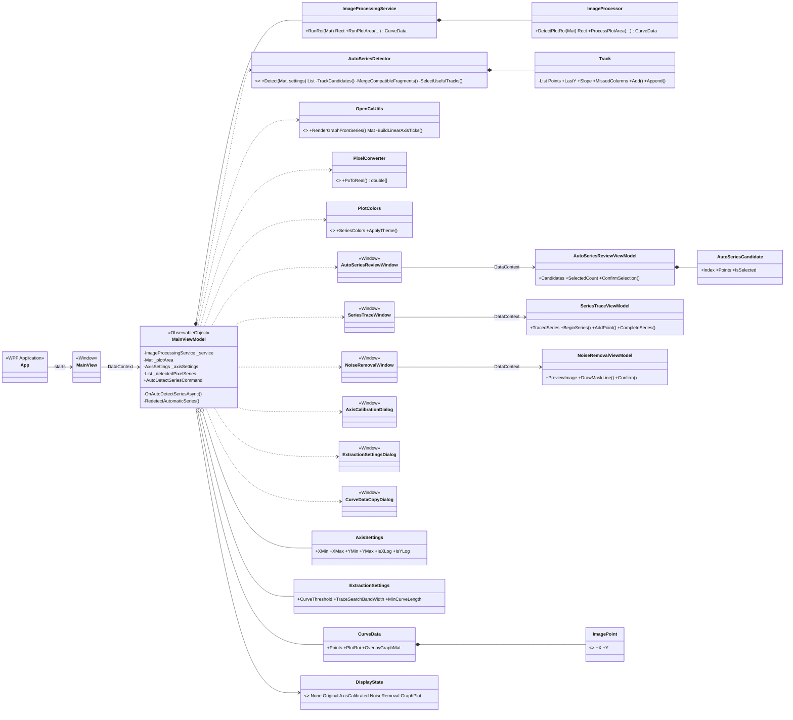
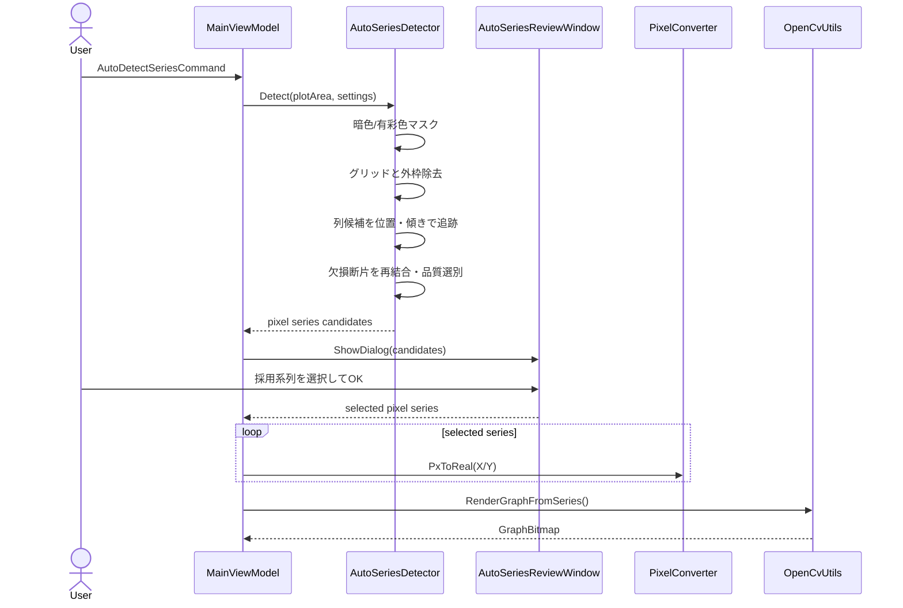
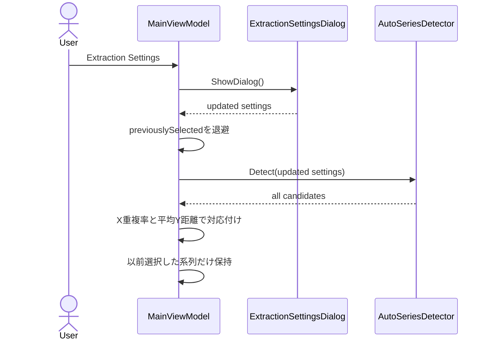
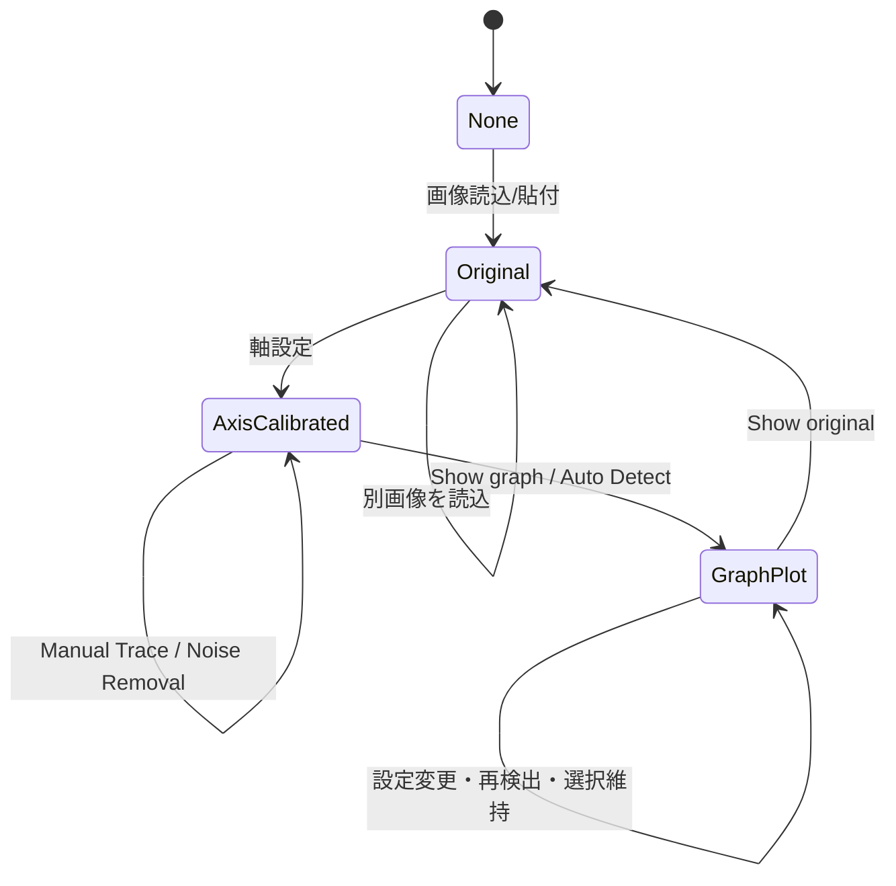
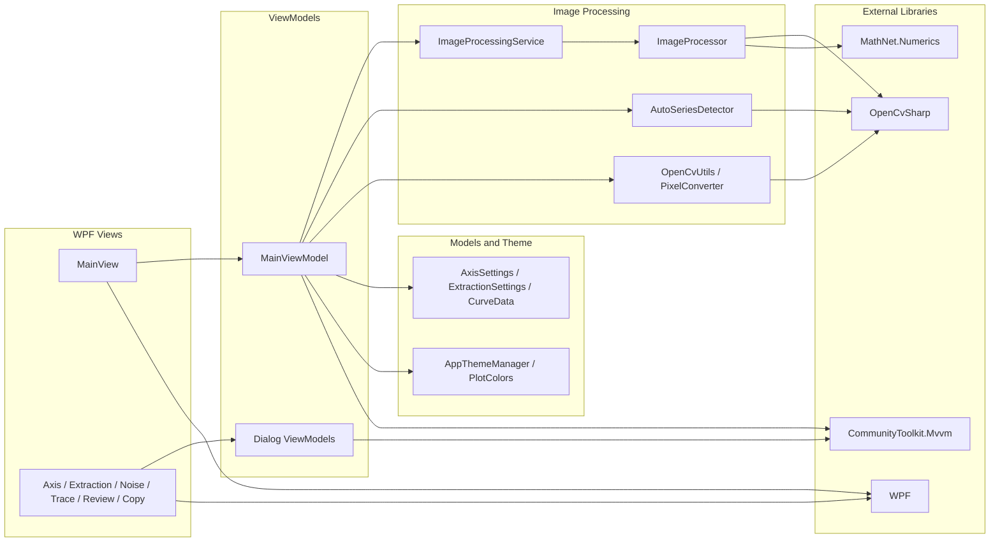

# AutoPlot UML（現行実装）

## 1. 主要クラス図

```mermaid
classDiagram
 direction LR
 class App { <<WPF Application>> }
 class MainView { <<Window>> }
 class MainViewModel {
  <<ObservableObject>>
  -ImageProcessingService _service
  -Mat _plotArea
  -AxisSettings _axisSettings
  -List _detectedPixelSeries
  +AutoDetectSeriesCommand
  -OnAutoDetectSeriesAsync()
  -RedetectAutomaticSeries()
 }
 class ImageProcessingService { +RunRoi(Mat) Rect +RunPlotArea(...) CurveData }
 class ImageProcessor { +DetectPlotRoi(Mat) Rect +ProcessPlotArea(...) CurveData }
 class AutoSeriesDetector { <<static>> +Detect(Mat, settings) List -TrackCandidates() -MergeCompatibleFragments() -SelectUsefulTracks() }
 class Track { -List Points +LastY +Slope +MissedColumns +Add() +Append() }
 class OpenCvUtils { <<static>> +RenderGraphFromSeries() Mat -BuildLinearAxisTicks() }
 class PixelConverter { <<static>> +PxToReal() double[] }
 class PlotColors { <<static>> +SeriesColors +ApplyTheme() }
 class AutoSeriesReviewWindow { <<Window>> }
 class AutoSeriesReviewViewModel { +Candidates +SelectedCount +ConfirmSelection() }
 class AutoSeriesCandidate { +Index +Points +IsSelected }
 class SeriesTraceWindow { <<Window>> }
 class SeriesTraceViewModel { +TracedSeries +BeginSeries() +AddPoint() +CompleteSeries() }
 class NoiseRemovalWindow { <<Window>> }
 class NoiseRemovalViewModel { +PreviewImage +DrawMaskLine() +Confirm() }
 class AxisCalibrationDialog { <<Window>> }
 class ExtractionSettingsDialog { <<Window>> }
 class CurveDataCopyDialog { <<Window>> }
 class AxisSettings { +XMin +XMax +YMin +YMax +IsXLog +IsYLog }
 class ExtractionSettings { +CurveThreshold +TraceSearchBandWidth +MinCurveLength }
 class CurveData { +Points +PlotRoi +OverlayGraphMat }
 class ImagePoint { <<struct>> +X +Y }
 class DisplayState { <<enumeration>> None Original AxisCalibrated NoiseRemoval GraphPlot }

 App --> MainView : starts
 MainView --> MainViewModel : DataContext
 MainViewModel *-- ImageProcessingService
 ImageProcessingService *-- ImageProcessor
 MainViewModel ..> AutoSeriesDetector
 AutoSeriesDetector *-- Track
 MainViewModel ..> OpenCvUtils
 MainViewModel ..> PixelConverter
 MainViewModel ..> PlotColors
 MainViewModel o-- AxisSettings
 MainViewModel o-- ExtractionSettings
 MainViewModel o-- CurveData
 CurveData *-- ImagePoint
 MainViewModel --> DisplayState
 MainViewModel ..> AutoSeriesReviewWindow
 AutoSeriesReviewWindow --> AutoSeriesReviewViewModel : DataContext
 AutoSeriesReviewViewModel *-- AutoSeriesCandidate
 MainViewModel ..> SeriesTraceWindow
 SeriesTraceWindow --> SeriesTraceViewModel : DataContext
 MainViewModel ..> NoiseRemovalWindow
 NoiseRemovalWindow --> NoiseRemovalViewModel : DataContext
 MainViewModel ..> AxisCalibrationDialog
 MainViewModel ..> ExtractionSettingsDialog
 MainViewModel ..> CurveDataCopyDialog
```

## 2. Auto Detectシーケンス

```mermaid
sequenceDiagram
 actor User
 participant VM as MainViewModel
 participant Detector as AutoSeriesDetector
 participant Review as AutoSeriesReviewWindow
 participant Converter as PixelConverter
 participant Graph as OpenCvUtils
 User->>VM: AutoDetectSeriesCommand
 VM->>Detector: Detect(plotArea, settings)
 Detector->>Detector: 暗色/有彩色マスク
 Detector->>Detector: グリッドと外枠除去
 Detector->>Detector: 列候補を位置・傾きで追跡
 Detector->>Detector: 欠損断片を再結合・品質選別
 Detector-->>VM: pixel series candidates
 VM->>Review: ShowDialog(candidates)
 User->>Review: 採用系列を選択してOK
 Review-->>VM: selected pixel series
 loop selected series
  VM->>Converter: PxToReal(X/Y)
 end
 VM->>Graph: RenderGraphFromSeries()
 Graph-->>VM: GraphBitmap
```

## 3. 設定変更後の選択維持

```mermaid
sequenceDiagram
 actor User
 participant VM as MainViewModel
 participant Settings as ExtractionSettingsDialog
 participant Detector as AutoSeriesDetector
 User->>VM: Extraction Settings
 VM->>Settings: ShowDialog()
 Settings-->>VM: updated settings
 VM->>VM: previouslySelectedを退避
 VM->>Detector: Detect(updated settings)
 Detector-->>VM: all candidates
 VM->>VM: X重複率と平均Y距離で対応付け
 VM->>VM: 以前選択した系列だけ保持
```

## 4. 状態図

```mermaid
stateDiagram-v2
 [*] --> None
 None --> Original: 画像読込/貼付
 Original --> AxisCalibrated: 軸設定
 AxisCalibrated --> GraphPlot: Show graph / Auto Detect
 AxisCalibrated --> AxisCalibrated: Manual Trace / Noise Removal
 GraphPlot --> GraphPlot: 設定変更・再検出・選択維持
 GraphPlot --> Original: Show original
 Original --> Original: 別画像を読込
```

## 5. コンポーネント図

```mermaid
flowchart LR
 subgraph UI[WPF Views]
  Main[MainView]
  Dialogs[Axis / Extraction / Noise / Trace / Review / Copy]
 end
 subgraph VM[ViewModels]
  MainVM[MainViewModel]
  DialogVM[Dialog ViewModels]
 end
 subgraph Processing[Image Processing]
  Service[ImageProcessingService]
  Processor[ImageProcessor]
  Auto[AutoSeriesDetector]
  Utils[OpenCvUtils / PixelConverter]
 end
 subgraph Domain[Models and Theme]
  Models[AxisSettings / ExtractionSettings / CurveData]
  Theme[AppThemeManager / PlotColors]
 end
 subgraph External[External Libraries]
  WPF[WPF]
  CV[OpenCvSharp]
  Toolkit[CommunityToolkit.Mvvm]
  Math[MathNet.Numerics]
 end
 Main --> MainVM
 Dialogs --> DialogVM
 MainVM --> Service & Auto & Utils & Models & Theme
 Service --> Processor
 Processor & Auto & Utils --> CV
 Main & Dialogs --> WPF
 MainVM & DialogVM --> Toolkit
 Processor --> Math
```

関連文書：`SourceCodeGuide.html`、`AutoDetectAlgorithm.html`。
